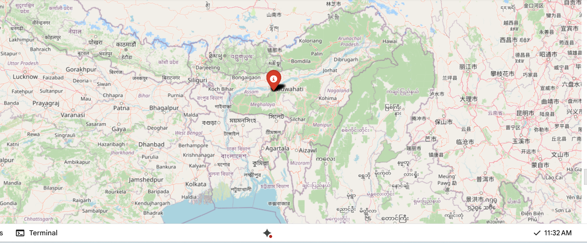

#  Dynamic Pricing for Urban Parking Lots

**Capstone Project – Summer Analytics 2025**  
Hosted by Consulting & Analytics Club(IIT Guwahati) × Pathway  
**Author**: Disha Hapani 
**Platform**: Google Colab, Python (pandas, numpy, bokeh)

---

##  Project Overview

Urban parking spaces are a limited and highly demanded resource. Static pricing often leads to either overutilization (congestion) or underutilization (waste). This capstone project develops a real-time dynamic pricing system for 14 parking lots using data-driven strategies and basic economic theory.

The objective is to simulate smart parking lot pricing by processing real-time streams and adjusting prices based on demand, congestion, competition, and special events — using Python and foundational ML logic.

---

##  Dataset Description

- **Duration**: 73 days  
- **Timepoints**: 18 per day (30-minute intervals from 8:00 AM to 4:30 PM)  
- **Lots**: 14 urban locations

### Features Used:
- **Location**: Latitude, Longitude (for proximity calculation)
- **Lot Info**: Capacity, Occupancy, Queue Length
- **Vehicle Info**: Type (Car, Bike, Truck)
- **Environment**: Traffic congestion level, Special day indicator
- **Derived Features**: Vehicle weight, Demand score, Nearby competition

---

##  Models Implemented

###  Model 1: Baseline Linear Pricing
- Price increases linearly with occupancy  
- Formula:
  `Price_t+1 = Price_t + α · (Occupancy / Capacity)`

###  Model 2: Demand-Based Pricing
- Multi-factor weighted demand function using:
- Occupancy rate
- Queue length
- Traffic level
- Special day
- Vehicle type weight  
- Formula:
  - Demand = α*(Occ/Cap) + βQueue - γTraffic + δSpecialDay + εVehicleWeight
  -Price = BasePrice · (1 + λ · NormalizedDemand)

- Prices are smoothly bounded between 0.5x–2x the base price.

###  Model 3: Competitive Pricing + Reroute (Optional)
- Considers prices and occupancy of nearby lots (via Haversine distance)
- Reduces price or suggests rerouting if overcrowded and competitors are cheaper
- Increases price if surrounding lots are expensive

---

##  Real-Time Simulation

Although Pathway is recommended for true real-time streaming, I simulate this behavior in Google Colab by:
- Processing data in timestamp order
- Emitting one pricing row at a time with `sleep()` delay
- Stateful logic for each lot across time
Optional Pathway implementation is possible via `@pw.udf` hooks.
---

## Visualizations

- **Real-time Bokeh plots** for multiple lots (animated pricing)
- **Model 2 vs Model 3 subplots** to compare pricing strategies
- **Folium map** for visualizing reroute recommendations
- **CSV output** for archival and analysis
###  Reroute Visualization (Preview)

---
## Conclusion

This simulation effectively demonstrates how simple rule-based models combined with real-time streaming and geo-awareness can help manage urban congestion. Model 3, which includes competitive intelligence and rerouting, performs best across utilization and pricing stability.

---

## Files Included

| File                          | Description                             |
|-------------------------------|-----------------------------------------|
| `Dynamic Pricing for Urban Parking.ipynb` | Main notebook (all models implemented)  |
| `final_output.csv`           | Clean final dataset with all model outputs |
| `reroute_map.html`           | Interactive reroute map (Folium)        |
| `README.md`                  | This file                               |

---
##  Architecture Diagram

graph TD
    -A[Input CSV Stream] --> B[Feature Engineering]
   - B --> C1[Model 1 - Linear Pricing]
   - B --> C2[Model 2 - Demand Pricing]
   - B --> C3[Model 3 - Competitive Pricing]
   - C1 --> D[Final CSV Output]
   - C2 --> D
   - C3 --> D
   - C3 --> E[Reroute Logic]
   - E --> F[Map Visualization (Folium)]

